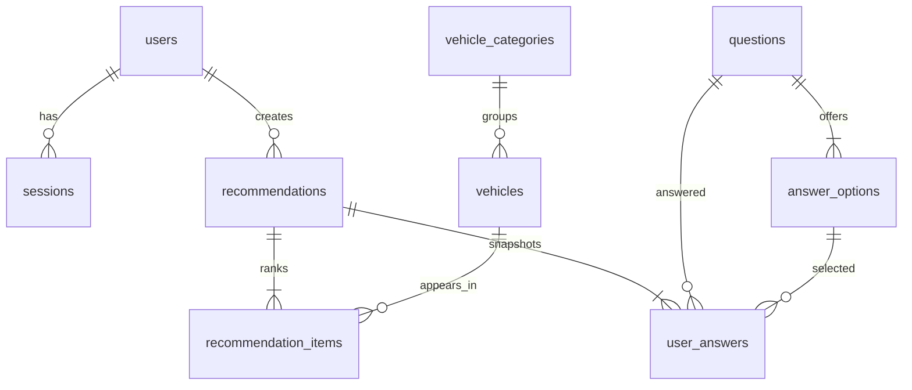

# Banco de dados

O PostgreSQL é inicializado pelas migrations em `migrations/`. A migration `0009`
fornece o catálogo e questionário iniciais e é executada uma única vez pelo
controle transacional do `golang-migrate`.

Índices principais cobrem sessões por expiração, veículos ativos/categoria,
perguntas por ordem e recomendações por usuário/data. Todas as entradas externas
são passadas como parâmetros `$1...$n`; concatenações no repositório montam apenas
fragmentos SQL estáticos, nunca valores do usuário.

O pool padrão usa 25 conexões abertas, 5 ociosas e vida máxima de 30 minutos.
Em produção, mantenha `DB_MAX_OPEN_CONNS` abaixo do limite do PostgreSQL dividido
pelo número de réplicas. Meça espera por conexão antes de ampliar o pool.
