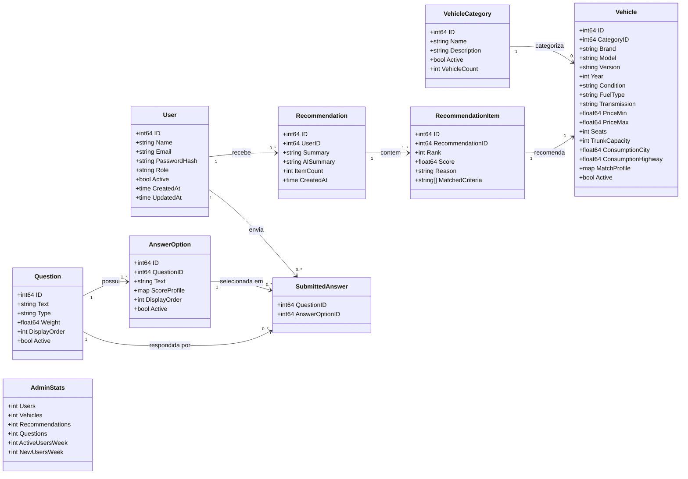
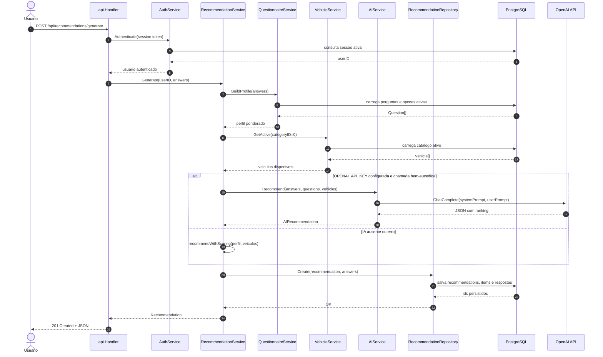
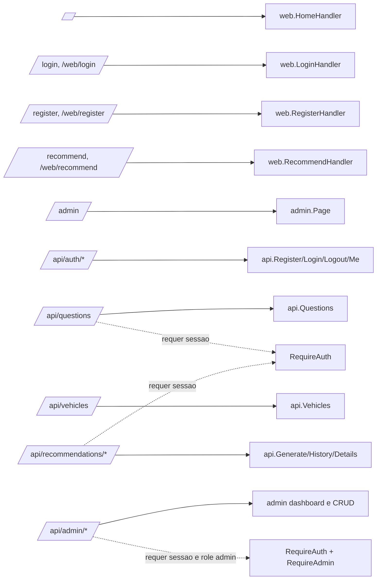

# Diagramas UML - Carro Ideal

Este documento resume a arquitetura do projeto `carro-ideal` a partir do código em `app/`, `config/`, `web/` e `migrations/`.

## Diagrama de Classes / Domínio

## Diagrama de Componentes / Camadas

```mermaid
flowchart TB
    Browser[Browser / Cliente Web]
    AdminUI[Painel Admin]

    subgraph HTTP[Camada HTTP - app/internal]
        WebHandler[web.Handler]
        APIHandler[api.Handler]
        AdminHandler[admin.Handler]
        HealthHandler[health.Handler]
        Middleware[platform middleware<br/>CORS, CSRF, rate limit, logs, recovery]
    end

    subgraph Services[Camada de Servicos - app/service]
        UserService[UserService]
        AuthService[AuthService]
        QuestionnaireService[QuestionnaireService]
        VehicleService[VehicleService]
        RecommendationService[RecommendationService]
        AdminService[AdminService]
        AIService[AIService]
        CatalogCache[CatalogCache]
    end

    subgraph Repositories[Camada de Persistencia - app/repository]
        UserRepository[UserRepository]
        SessionRepository[SessionRepository]
        QuestionRepository[QuestionRepository]
        VehicleRepository[VehicleRepository]
        RecommendationRepository[RecommendationRepository]
        AdminRepository[AdminRepository]
    end

    subgraph Infra[Infraestrutura]
        Config[config.Config]
        DB[(PostgreSQL)]
        Migrations[golang-migrate<br/>migrations/*.sql]
        OpenAIClient[clients.OpenAIClient]
        OpenAI[(OpenAI Chat Completions)]
    end

    Browser --> Middleware
    AdminUI --> Middleware
    Middleware --> WebHandler
    Middleware --> APIHandler
    Middleware --> AdminHandler
    Middleware --> HealthHandler

    WebHandler --> UserService
    WebHandler --> AuthService
    APIHandler --> UserService
    APIHandler --> AuthService
    APIHandler --> QuestionnaireService
    APIHandler --> VehicleService
    APIHandler --> RecommendationService
    AdminHandler --> UserService
    AdminHandler --> AuthService
    AdminHandler --> AdminService
    HealthHandler --> DB

    UserService --> UserRepository
    AuthService --> SessionRepository
    QuestionnaireService --> QuestionRepository
    QuestionnaireService --> CatalogCache
    VehicleService --> VehicleRepository
    VehicleService --> CatalogCache
    RecommendationService --> QuestionnaireService
    RecommendationService --> VehicleService
    RecommendationService --> RecommendationRepository
    RecommendationService --> AIService
    AdminService --> AdminRepository
    AdminService --> CatalogCache
    AIService --> OpenAIClient

    UserRepository --> DB
    SessionRepository --> DB
    QuestionRepository --> DB
    VehicleRepository --> DB
    RecommendationRepository --> DB
    AdminRepository --> DB
    Migrations --> DB
    Config --> DB
    OpenAIClient --> OpenAI
```

## Sequencia: Gerar Recomendacao

## Rotas Principais

